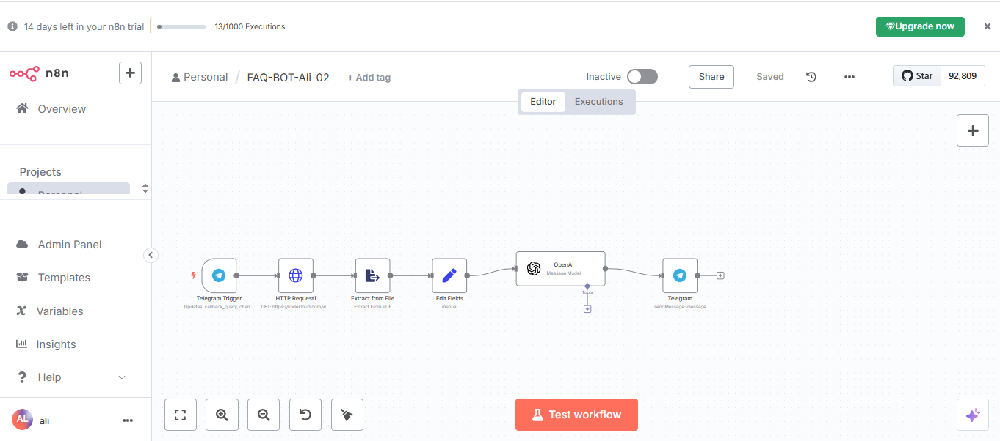

*Telegram* *FAQ* *BOT*
*using* *N8N* *AI* *Agent* *–* *Asgar* *Ali* *Ansari*

**Project:** **FAQ-BOT-Ali-02** **–** **Automated** **FAQ** **Bot**
**with** **Telegram,** **PDF** **Extraction,** **and** **OpenAI**
**(n8n)**

**Overview**

This project demonstrates how to build an automated FAQ bot using n8n.
The bot receives questions via Telegram, extracts information from a PDF
document, and uses OpenAI to generate answers, which are then sent back
to the user on Telegram.

**Workflow** **Steps**

**1.** **Telegram** **Trigger** **Node**

> • **Purpose:** Listens for incoming messages from users on a Telegram
> bot.
>
> • **Setup:**
>
> o Connect your Telegram bot using the Bot Token.
>
> o Configure the node to trigger on new messages.

**2.** **HTTP** **Request** **Node** **(Download** **PDF)**

> • **Purpose:** Downloads a PDF file containing the FAQ or knowledge
> base.
>
> • **Setup:**
>
> o Set the HTTP Method to GET.
>
> o Enter the URL of the PDF file.
>
> o Set the Response Format to "File" to download the PDF.

**3.** **Extract** **from** **File** **Node**

> • **Purpose:** Extracts text content from the downloaded PDF.
>
> • **Setup:**

*Telegram* *FAQ* *BOT* *using* *N8N* *AI* *Agent* *–* *Asgar* *Ali*
*Ansari*

> o Use the output from the HTTP Request node as input.
>
> o Select the operation to extract text from the PDF file.

**4.** **Edit** **Fields** **Node** **(Prepare** **Prompt)**

> • **Purpose:** Prepares a prompt for OpenAI by combining the user’s
> question with the extracted PDF content.
>
> • **Setup:**
>
> o Use expressions to merge the Telegram message and the extracted
> text.
>
> o Format the prompt to provide context for OpenAI.

**5.** **OpenAI** **Node**

> • **Purpose:** Sends the prepared prompt to OpenAI and receives a
> generated answer.
>
> • **Setup:**
>
> o Connect your OpenAI API key.
>
> o Choose the appropriate model (e.g., GPT-3.5 or GPT-4).
>
> o Pass the prompt from the previous node.

**6.** **Telegram** **Node** **(Send** **Response)**

> • **Purpose:** Sends the generated answer back to the user on
> Telegram.
>
> • **Setup:**
>
> o Use the chat ID from the original Telegram message.
>
> o Send the response received from OpenAI.

**Key** **Features**

> • **End-to-End** **Automation:** From receiving a question to
> delivering an AI-generated answer.
>
> • **PDF** **Knowledge** **Base:** Dynamically extracts information
> from a PDF file.
>
> • **AI-Powered** **Responses:** Uses OpenAI for natural language
> understanding and answer generation.
>
> • **User-Friendly:** Interacts with users directly on Telegram.

**How** **to** **Deploy**

> 1\. **Set** **Up** **n8n:** Install n8n on your preferred environment
> (cloud, desktop, or self-hosted).
>
> 2\. **Create** **a** **Telegram** **Bot:** Use BotFather on Telegram
> to get your bot token.
>
> 3\. **Configure** **Nodes:**

*Telegram* *FAQ* *BOT* *using* *N8N* *AI* *Agent* *–* *Asgar* *Ali*
*Ansari*

> o Add and configure each node as described above.
>
> o Ensure all API keys and URLs are securely stored.
>
> 4\. **Test** **the** **Workflow:** Send a message to your Telegram bot
> and verify the response.
>
> 5\. **Activate** **the** **Workflow:** Once tested, activate the
> workflow in n8n.

**Example** **Use** **Case**

> • A user sends a question to the Telegram bot: “What is the refund
> policy?”
>
> • The workflow downloads the latest FAQ PDF, extracts the text, and
> sends the question plus the FAQ content to OpenAI.
>
> • OpenAI generates a relevant answer, which is sent back to the user
> on Telegram.

**Technologies** **Used**

> • **n8n** (Workflow Automation)
>
> • **Telegram** **Bot** **API**
>
> • **OpenAI** **API**
>
> • **PDF** **Extraction**

**Tips**

> • Keep your PDF knowledge base updated for accurate answers.
>
> • Monitor usage and logs in n8n for troubleshooting.
>
> • Secure your API keys and sensitive data.
